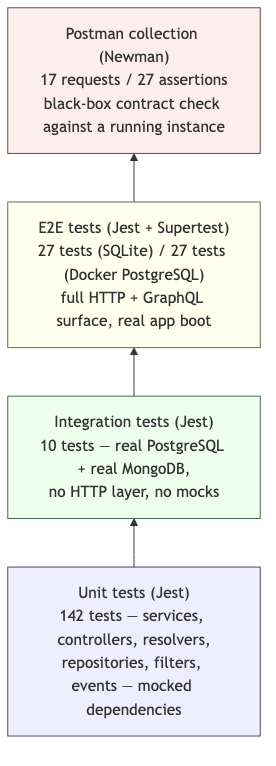
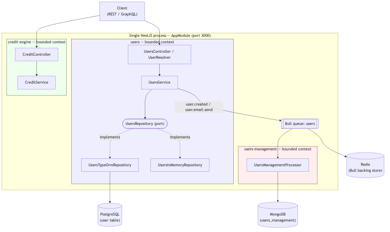
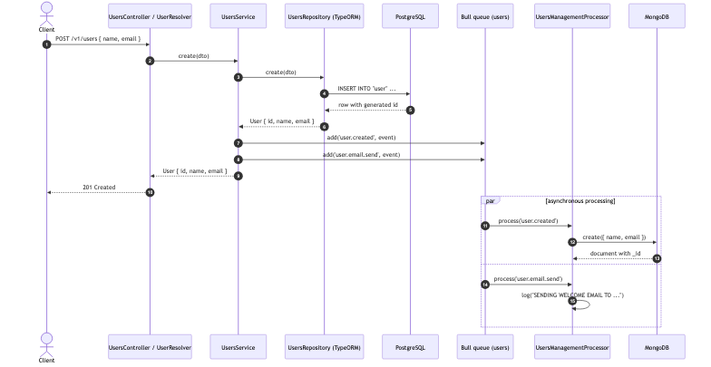
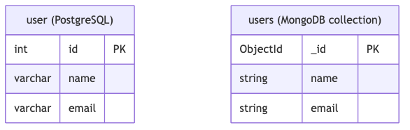

# NestJS Modular Monolith

A **Modular Monolithic Architecture** built with [NestJS](http://nestjs.com/): a single deployable application organized as a set of independent **bounded contexts**, each free to choose the persistence technology (ORM/ODM) that best fits its own data. Dual REST + GraphQL APIs, queue-driven background processing, and a four-layer test suite (unit → integration → e2e → Postman collection) complete the picture.

See [`docs/`](docs/) for architecture, sequence and data-model diagrams, and the Postman collection.

---

## Architecture Overview

Every module under `src/modules/` is a bounded context: it owns its controller, service, domain model, and data-access layer end to end. No module imports another module's repository, entity, or schema directly — cross-module communication only happens through Bull queues. This is what keeps the codebase a *modular* monolith instead of a tangle of shared tables: one deployable process, but internal boundaries as strict as if the modules were separate services.

```
src/
├── common/
│   ├── constants/       # TypeORM datasource factory
│   ├── events/          # Domain events (UserCreatedEvent)
│   ├── filters/         # Global HTTP exception filter
│   ├── loggers/         # Winston logger (TRANSIENT scope)
│   └── s3/              # AWS S3 upload service
├── config/              # database / redis / s3 configs (ConfigModule)
├── ioC/
│   └── app.module.ts    # Root module
└── modules/
    ├── users/                       # bounded context: core user identity — TypeORM / PostgreSQL
    │   ├── domain/
    │   │   ├── models/              # User — plain domain model (no ORM decorators)
    │   │   ├── repositories/        # UsersRepository port + provider (datasource-swappable)
    │   │   │   └── implementations/
    │   │   │       ├── users.typeorm.entity.ts      # UserOrmEntity — TypeORM-only, mapped to User
    │   │   │       ├── users.typeorm.repository.ts
    │   │   │       └── users.in-memory.repository.ts
    │   │   └── users.service.ts     # Business logic, queues Bull jobs on create
    │   └── http/
    │       ├── dtos/                # CreateUserDto / UpdateUserDto / UserOutput (GraphQL)
    │       ├── users.controller.ts
    │       └── user.resolver.ts
    ├── credit-engine/                # bounded context: placeholder, no persistence yet — same process, same port
    └── users-management/             # bounded context: async user side-effects — Mongoose / MongoDB
        ├── domain/                   # Mongoose schema
        └── queues/                   # Bull processor (verify + sendEmail jobs)
```

### Multi-ORM by bounded context

There is no single, app-wide ORM. Each module picks the data-access tool that matches its own access pattern, and the module boundary is the only thing keeping them from colliding:

| Bounded context | ORM / client | Store | Why this choice |
|---|---|---|---|
| `users` | [TypeORM](https://typeorm.io/) behind a `UsersRepository` port (`user.repository.interface.ts`) | PostgreSQL | Core user identity needs relational consistency (unique emails, numeric IDs). The service depends only on the `UsersRepository` interface and the plain `User` domain model — never on TypeORM directly. The `@Entity`-decorated `UserOrmEntity` lives exclusively inside `users.typeorm.repository.ts`, which maps rows back to `User`. `provideUsersRepositoryFactory` swaps in `UsersTypeOrmRepository` or `UsersInMemoryRepository` at runtime based on the `DATABASE_DATASOURCE` env var, so unit tests and local runs never need a real Postgres connection. |
| `users-management` | [Mongoose](https://mongoosejs.com/) via `@nestjs/mongoose` | MongoDB | This context processes background side-effects of user creation (e.g. the welcome-email job) and is expected to grow more loosely-structured job/audit payloads over time — a schema-flexible document store fits that better than a relational table, and it's reached only through the Bull queue, never a direct call from `users`. |
| `credit-engine` | — | — | Placeholder bounded context (`GET /v1/credit` health check only). It will pick its own store once real domain requirements land — nothing here presumes TypeORM or Mongoose. |

The rule that makes this safe: a module's ORM choice is a private implementation detail of that bounded context. Nothing outside `users/domain/repositories` knows or cares that TypeORM is involved, and nothing outside `users-management/domain` knows Mongoose is involved — swapping either one out only touches that module.

---

## Prerequisites

| Tool | Version |
|------|---------|
| Node.js | 24+ |
| npm | 10+ |
| TypeScript | 5.x (bundled as a devDependency, see `package.json`) |
| Docker & Docker Compose | 24+ |

Dependencies are kept current: NestJS 11, TypeORM 0.3, Mongoose 9, ESLint 10 (flat config via `eslint.config.mjs`), Prettier 3, and Jest 29. TypeScript runs in `strict` mode (`tsconfig.json`). Run `npm outdated` at any time to check for newer releases.

---

## Environment Setup

Copy the example and fill in the values:

```bash
cp .env.example .env   # or create .env manually from the table below
```

| Variable | Example | Description |
|----------|---------|-------------|
| `DATABASE_DATASOURCE` | `typeorm` | Active datasource for the `users` repository — `typeorm` or `memory` (any other value falls back to the in-memory adapter) |
| `TYPEORM_TYPE` | `postgres` | TypeORM driver |
| `TYPEORM_HOST` | `0.0.0.0` | PostgreSQL host |
| `TYPEORM_PORT` | `5432` | PostgreSQL port |
| `TYPEORM_USERNAME` | `qso_user` | DB user |
| `TYPEORM_PASSWORD` | `qso_password` | DB password |
| `TYPEORM_DATABASE` | `qso_example` | DB name |
| `MONGODB_URL` | `mongodb://127.0.0.1:27017/users_management` | MongoDB connection (used by the `users-management` bounded context) |
| `REDIS_HOST` | `127.0.0.1` | Redis host |
| `REDIS_PORT` | `6379` | Redis port |

---

## Running with Docker

```bash
# Start PostgreSQL, Redis and MongoDB (all three are required at boot)
docker compose up -d

# Install dependencies
npm install

# Start the application (hot-reload)
npm run start:dev
```

The API is available at `http://localhost:3000`.

---

## Available Scripts

```bash
# Development
npm run start:dev          # NestJS with hot-reload (Nodemon)
npm run start:prod         # Run compiled build

# Build
npm run build

# Code quality
npm run lint               # ESLint (check-only, used in CI)
npm run lint:fix           # ESLint + auto-fix
npm run format             # Prettier (write)
npm run format:check       # Prettier (check-only, used in CI)

# Tests
npm run test               # Unit tests (Jest)
npm run test:watch         # Unit tests in watch mode
npm run test:cov           # Unit tests with coverage report
npm run test:integration   # Integration tests against real PostgreSQL + MongoDB (requires Docker)
npm run test:e2e           # E2E tests against SQLite in-memory
npm run test:e2e:docker    # E2E tests against real PostgreSQL (requires Docker)

# Postman collection (requires the app running on localhost:3000)
npx newman run docs/postman/nestjs-modular-monolith.postman_collection.json
```

---

## REST API

All endpoints are prefixed with `/v1`.

### Users — `GET /v1/users`

Returns the list of all users.

**Response 200**
```json
[{ "id": 1, "name": "John Doe", "email": "john@example.com" }]
```

### Users — `POST /v1/users`

Creates a new user.

**Body**
```json
{ "name": "John Doe", "email": "john@example.com" }
```

**Response 201** — created user object with generated `id`.

### Users — `GET /v1/users/:id`

Returns a single user by numeric ID.

**Response 200** — user object  
**Response 404** — user not found

### Users — `PATCH /v1/users/:id`

Partially updates a user. Both `name` and `email` are optional.

**Body**
```json
{ "name": "Jane Doe" }
```

**Response 200** — updated user object  
**Response 404** — user not found

### Users — `DELETE /v1/users/:id`

Deletes a user.

**Response 204** — no content  
**Response 404** — user not found

### Credit Engine — `GET /v1/credit`

Health-check endpoint for the credit engine module.

**Response 200** — `Hello Credit Engine`

---

## GraphQL API

Playground available at `http://localhost:3000/graphql`.

```graphql
# List all users
query {
  findAll {
    id
    name
    email
  }
}

# Find user by ID — returns null (no GraphQL error) if not found, since `findUser`
# catches the service's NotFoundException and resolves to null for this nullable field
query {
  findUser(id: 1) {
    id
    name
    email
  }
}

# Create user
mutation {
  create(data: { name: "John Doe", email: "john@example.com" }) {
    id
    name
    email
  }
}
```

GraphQL errors (validation failures, unexpected exceptions) are returned through the standard `errors` array in the GraphQL response body, formatted by the same `AllExceptionsFilter` used for REST — it detects the execution context (`host.getType()`) and never touches the raw HTTP response object when running inside a resolver.

---

## Error Responses

All errors follow the same shape:

```json
{
  "statusCode": 404,
  "message": "User with ID 99 not found",
  "timestamp": "2024-01-01T00:00:00.000Z",
  "path": "/v1/users/99"
}
```

---

## Testing

Four independent layers, each catching a different class of bug — see [`docs/mmd/testing-strategy.mmd`](docs/mmd/testing-strategy.mmd) / [`docs/img/testing-strategy.png`](docs/img/testing-strategy.png):



### Unit Tests

```bash
npm run test
```

Covers every service, controller, resolver, repository, filter, event, and the Mongoose/S3 integration points, using Jest mocks — zero external dependencies required.

### Integration Tests

```bash
# Prerequisite: containers must be running
docker compose up -d postgres mongodb_container

npm run test:integration
```

Exercises `UsersTypeOrmRepository` against a real PostgreSQL instance and `UsersManagementProcessor` against a real MongoDB instance — no HTTP layer, no mocks, just the persistence code talking to the real database it was written for.

### E2E — SQLite (no Docker)

```bash
npm run test:e2e
```

Spins up the full NestJS application with an SQLite in-memory database. Covers complete CRUD, GraphQL queries/mutations, validation errors, and error-response shape (happy and sad paths) — no external services required.

### E2E — PostgreSQL (Docker)

```bash
# Prerequisite: containers must be running
docker compose up -d

npm run test:e2e:docker
```

Runs the same scenarios against the real PostgreSQL container. Each test starts with a clean `user` table (via `DELETE FROM "user"`). Verifies true persistence, auto-generated IDs, and data integrity across sequential requests.

### Postman Collection (Newman)

```bash
npm run start:dev   # or start:prod, in another terminal
npx newman run docs/postman/nestjs-modular-monolith.postman_collection.json
```

A black-box contract check against a *running* instance: every REST and GraphQL request carries an inline test asserting either a happy path (2xx, correct payload) or a sad path (4xx / GraphQL error, correct error shape). See [`docs/postman/`](docs/postman/).

| Suite | Config file | Target | Coverage |
|-------|-------------|--------|----------|
| Unit | `package.json` (default Jest) | mocked | 142 tests |
| Integration | `test/jest-integration.json` | real PostgreSQL + MongoDB | 10 tests |
| E2E SQLite | `test/jest-e2e.json` | SQLite `:memory:` | 27 tests |
| E2E Docker | `test/jest-e2e-docker.json` | real PostgreSQL | 27 tests |
| Postman / Newman | `docs/postman/*.json` | running app instance | 17 requests / 27 assertions |

---

## Event-Driven Flow

When a user is created via REST or GraphQL:

1. `UsersService.create()` persists the user through the `UsersRepository` port
2. Two Bull jobs (`user.created`, `user.email.send`) are queued on the `users` queue with a `UserCreatedEvent` payload
3. `UsersManagementProcessor` processes each job asynchronously: `verify()` records the event in MongoDB, `sendEmail()` logs the welcome email

This is also the boundary between the two ORM-backed bounded contexts: `users` (TypeORM/Postgres) never talks to MongoDB, and `users-management` (Mongoose/MongoDB) never talks to Postgres — they only ever exchange a queue payload.

---

## Documentation & Diagrams

```
docs/
├── mmd/                          # Mermaid diagram sources (edit these)
│   ├── architecture-overview.mmd
│   ├── user-creation-sequence.mmd
│   ├── data-model.mmd
│   └── testing-strategy.mmd
├── img/                          # Rendered PNGs (generated, committed for GitHub rendering)
│   └── *.png
└── postman/
    └── nestjs-modular-monolith.postman_collection.json
```

### Architecture overview



### User creation — sequence



### Data model

Each bounded context owns its schema; there is no foreign key between them — they only ever meet through the Bull queue payload.



Diagrams are written in [Mermaid](https://mermaid.js.org/) and rendered to PNG with `@mermaid-js/mermaid-cli`:

```bash
npx -p @mermaid-js/mermaid-cli -p puppeteer mmdc -i docs/mmd/<name>.mmd -o docs/img/<name>.png -b transparent
```

---

## CI/CD

GitHub Actions (`.github/workflows/ci.yml`) runs on every push against live PostgreSQL, Redis and MongoDB service containers:

1. Install dependencies
2. Prettier format check (fails the build instead of silently rewriting files)
3. ESLint (flat config, check-only — `npm run lint:fix` is for local use)
4. TypeScript compilation check (`strict: true`)
5. Unit tests with coverage
6. Integration tests (real PostgreSQL + MongoDB)
7. E2E tests — SQLite in-memory
8. E2E tests — real PostgreSQL
9. `npm audit` security scan (non-blocking)
10. Build the application
11. Boot the compiled build and replay the Postman collection against it (Newman)
12. Docker image build + `docker compose config` sanity check

---

## Docker Services

```yaml
# docker-compose.yml
postgres:           # qso     — port 5432  (PostgreSQL 11.8)
mongodb_container:  #         — port 27017 (MongoDB latest)
redis:               # qso_redis — port 6379  (Redis alpine)
```

The application container is defined in `docker-compose.yml` but commented out; run `npm run start:dev` locally for development.
